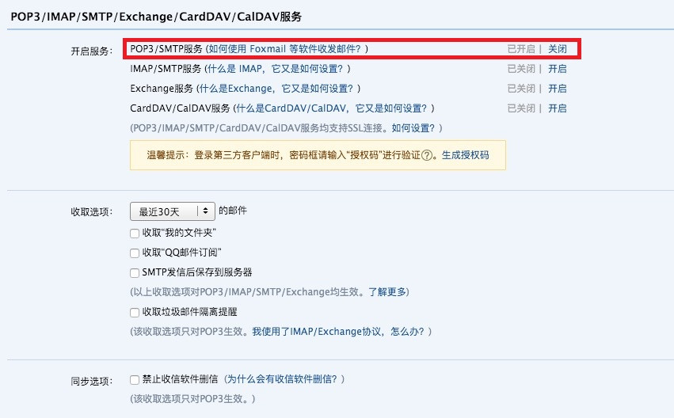

# Laravel Mail 配置

邮件相关的默认配置，打开 `.env` :

```shell
MAIL_DRIVER=smtp
MAIL_HOST=smtp.mailtrap.io
MAIL_PORT=2525
MAIL_USERNAME=null
MAIL_PASSWORD=null
MAIL_ENCRYPTION=null
```

在  `config/mail.php` 中有相关说明：

*MAIL_DRIVER*： 一般保持默认的 `smtp` 即可。
*MAIL_HOST* ：邮箱的主机，常用的：QQ邮箱（`smtp.qq.com`）、163 邮箱（`smtp.163.com`）等。
*MAIL_PORT*：用于配置邮箱发送服务端口号,一般为 `25`, 但如果设置SMTP使用SSL加密，该值为465。
*MAIL_USERNAME*：邮箱的登录名，即为邮箱账号。
*MAIL_PASSWORD*：邮箱登录密码，QQ 邮箱有例外，后面说明。
*MAIL_ENCRYPTION*：加密类型，默认为 null,如果使用 SSL,则为 ssl 。

在 `mail.php` 中，还有 `from` 的配置：

*MAIL_FROM_ADDRESS* ： 发送邮件的账号，一般设置和 `MAIL_USERNAME` 相同。
*MAIL_FROM_NAME*：发送邮件的用户名，一般设为应用的名称。

QQ 邮箱的设置：

开启 smtp:



如下图，复制左侧生成的授权码作为密码：


如果要保存已发送的邮箱到服务器，在收取选项中勾选 `SMTP 发信后保存到服务器`。

配置示例：

```shell
MAIL_DRIVER=smtp
MAIL_HOST=smtp.qq.com
MAIL_PORT=465
MAIL_USERNAME=mailteam@qq.com
MAIL_PASSWORD=11111
MAIL_ENCRYPTION=ssl
MAIL_FROM_ADDRESS =mailteam@qq.com
MAIL_FROM_NAME=App
```

参考：
[https://www.jianshu.com/p/8ccb2820df23](http://)
[https://blog.csdn.net/wulove52/article/details/71172842](http://)